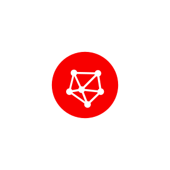
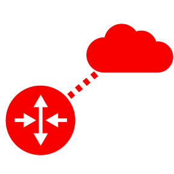

# OCI Kinetic Infrastructure Toolkit

OCI Kinetic Infrastructure Toolkit (OKIT) is a a series of tools that allow the user to Query, Capture, Visualise and
Generate DevOps tooling scripts. Using the toolkit the DevOps user will be able to capture existing OCI environments,
through simple command line or web based interface, and then convert them to standard DevOps languages (see below). 
The web based drawing toll can also be used to generate simple architectural representations of customer systems that 
can quickly be turned into code and ultimately built in the OCI environment.

## Installation
Although OKIT can simply be downloaded and the command line executed it is recommended that it be executed within a
docker container that can be built using the Dockerfile within this repository. This will guarantee that all the required 
python modules are installed and in addition provide a simple flask server that will present the web based application on
[http://localhost:8080/okit/designer](http://localhost:8080/okit/designer).

Therefore these installation instructions will describe the docker based implementation.

```bash
anhopki-mac:tmp anhopki$ git clone git@orahub.oraclecorp.com:andrew.hopkinson/okit.oci.web.designer.git

Cloning into 'okit.oci.web.designer'...
===============================================================================
            Oracle USA Inc. - Unauthorized Access Strictly Prohibited
-------------------------------------------------------------------------------
   WARNING: This is a restricted access server. If you do not have explicit
            permission to access this server, please disconnect immediately.
            Unauthorized access to this system is considered gross misconduct
            and may result in disciplinary action, including revocation of
            access privileges, immediate termination of employment.
===============================================================================
remote: Enumerating objects: 448, done.
remote: Counting objects: 100% (448/448), done.
remote: Compressing objects: 100% (208/208), done.
remote: Total 1455 (delta 287), reused 376 (delta 229)00 KiB/s
Receiving objects: 100% (1455/1455), 604.46 KiB | 798.00 KiB/s, done.
Resolving deltas: 100% (859/859), done.

anhopki-mac:tmp anhopki$ cd okit.oci.web.designer/docker/
anhopki-mac:docker anhopki$ lh

total 56
0 drwxr-xr-x  10 anhopki  staff   320B 15 Aug 10:08 .
0 drwxr-xr-x   9 anhopki  staff   288B 15 Aug 10:08 ..
8 -rwxr-xr-x   1 anhopki  staff   932B 15 Aug 10:08 build-docker-image.sh
8 -rwxr-xr-x   1 anhopki  staff   238B 15 Aug 10:08 connect-flask-bash-shell.sh
8 -rwxr-xr-x   1 anhopki  staff   241B 15 Aug 10:08 connect-gunicorn-bash-shell.sh
0 drwxr-xr-x   3 anhopki  staff    96B 15 Aug 10:08 docker
8 -rwxr-xr-x   1 anhopki  staff   1.6K 15 Aug 10:08 docker-env.sh
8 -rwxr-xr-x   1 anhopki  staff   512B 15 Aug 10:08 start-bash-shell.sh
8 -rwxr-xr-x   1 anhopki  staff   621B 15 Aug 10:08 start-flask.sh
8 -rwxr-xr-x   1 anhopki  staff   654B 15 Aug 10:08 start-gunicorn.sh

anhopki-mac:docker anhopki$ ./build-docker-image.sh
```

## Usage
### Web Interface

#### Palette
-  Virtual Cloud Network 
-  Internet Gateway
-  Route Table
-  Security List
-  Subnet
-  Instance
-  Load Balancer
#### Menu


- File
  - New
  - Load
  - Save
- Canvas
  - Redraw
- Export
  - SVG
  - Resource Manager
  - Orca
- Query
  - OCI
- Generate
  - Terraform
  - Ansible

##### File/New
Creates a new clear canvas.
##### File/Load
Allows the user to select a previously saved or command line generated json file.
##### File/Save
Saves the current diagram as a json representation.
##### Canvas/Redraw
Redraws the existing canvas this will have the effect of grouping similar assets.
##### Export/SVG
Will export the current diagram as an SVG object that can be distributed.
##### Export/Resource Manager


### Command Line

## Cleanup

## Development

## Contributing

Bug reports, enhancement request and pull requests are welcome on the OraHub at [okit.oci.web.designer/issues](https://orahub.oraclecorp.com/cloud-tools-ateam/okit.oci.web.designer/issues)

## Examples