# OCI Designer Toolkit Usage Guide


## Table of Contents

1. [Supported Browsers](#supported-browsers)
2. [Currently Implemented Artifacts](#currently-implemented-artifacts)
3. [Web Interface](#web-interface)
4. [Examples](#examples)


## Supported Browsers
At present not all browsers are fully supported the following is a list of supported browsers and status.
- Supported
   - Chrome
   - Brave
   - Chromium Based Browsers
   - Firefox 
- Partially Supported
   - Safari
- Unsupported
   - IE

## Currently Implemented Artifacts
In the present release the following OCI artifacts have been implemented. The information captured in the properties may 
only be the minimum to create the artifacts but will be extended in the future.

- Virtual Cloud Network 
- Internet Gateway
- Route Table
- Security List
- Subnet
- Instance
- Load Balancer
- Vnics
- Autonomous Database
- Block Storage Volumes
- Object Storage Buckets
- Database Systems

## Web Interface
To access the Web Designer Interface you will need to start either the [Docker Container](Installation.md#build-docker-image) 
or [Vagrant Image](Installation.md#build-vagrant-image) created during [Installation](Installation.md). This can be achieved 
by executing one of the commands below depending on your choice of container.

### Docker Compose
```bash
cd oci-designer-toolkit/containers/docker
docker-compose up
```

### Docker
```bash
cd oci-designer-toolkit
docker run -d --rm -p 443:443 -p 80:80 \
           --name okit \
           --hostname okit \
           --volume ~/okit/user/templates:/okit/templates \
           okit
```
The __<OKIT_ROOT_DIR>/containers/scripts__ contains helper scripts for Linux/Mac and Windows PowerShell.

- Linux/Mac : start-okit-server.sh
- Windows PowerShell : start_okit_server_win.ps1 

If you want to run the image in and interactive mode then replace to _-d_ in the above command with _-it_.

### Vagrant
```bash
cd oci-designer-toolkit/containers/vagrant/
vagrant up; vagrant ssh
```

### Designer BUI
The Designer BUI can be accessed on [http://localhost/okit/designer](http://localhost/okit/designer) and consists of 3 main areas.
1. Palette
2. Canvas
3. Properties Sheet

The palette should all currently available assets and they can be dragged from the palette on the canvas below. During the 
drag process the icon will indicate if the palette icon can be dropped on the underlying component. If appropriate a "+" 
sign will be displayed. Once the icon has been dropped the appropriate properties sheet will be displayed for the new asset.

If assets (e.g. subnet) are dropped within a containing asset (e.g. virtual cloud network) then it will be associated with the 
containing asset. Alternatively assets may be linked using connectors which can be dragged from the asset to associate
(e.g. route table) to the associated asset (e.g. subnet). Again the drop is only appropriate on certain components and 
the web front end will restrict this.

A simple diagram representing a virtual Cloud Network with associated Internet Gateway, Route Table, Security List and 
Instances fronted by a Load Balancer can be seen below.


The hamburger menu in the top left will display a slide out menu with all available actions (described below).

#### Palette
- Compute
    -                   Instance
- Containers
    -             Compartment
- Database
    -       Autonomous Database
    -           Database System
- Gateways
    -   Dynamic Routing Gateway
    -          Internet Gateway
    -               NAT Gateway
    -           Service Gateway
    -     Local Peering Gateway
- Networking
    -            Fast Connect
    -           Load Balancer
    -  Network Security Group
    -             Route Table
    -           Security List
    -                  Subnet
    -   Virtual Cloud Network
- Storage
    -       Block Storage Volume
    -        File Storage System
    -      Object Storage Bucket

#### Menu 


- Canvas
    - New
    - Load
    - Save
        - Save
        - Save As Template
    - Query
    - Redraw
- Templates
    - Infrastructure
    - Network
    - Reference Architecture
- Generate
- Export
    - Image
        - png
        - jpeg
        - svg
    - Terraform
    - Resource Manager

##### Canvas/New
Creates a new clear canvas.
##### Canvas/Load
Allows the user to select a previously saved or command line generated json file.
##### Canvas/Save
Saves the current diagram as a json representation.
#### Canvas/Query
Opens Query pages and populates the Compartment list. Once the user has chosen the compartment and regions.  
Submitting will query OCI and draw the returning assets on the new designer canvas.
##### Canvas/Redraw
Redraws the existing canvas this will have the effect of grouping similar assets.
##### Templates
This is a dynamic menu that represents the available templates that can be loaded as a starting point for system development.
#### Export/Terraform
Generate a set of Terraform that can be used to build the designed OCI infrastructure currently loaded and return as a zip file.
##### Export/Image/png
Will export the current diagram as a png image that can be distributed.
##### Export/Image/jpeg
Will export the current diagram as a jpeg image that can be distributed.
##### Export/Image/svg
Will export the current diagram as an SVG object that can be distributed.
##### Export/Resource Manager
Will generate Terraform code and export the resulting zip file into the OCI Resource Manager. Once uploaded it will initiate
a plan or apply job.


# Examples
The following short tutorial will take you through a worked example for creating a simple 2 Instance load balanced nginx
implementation. The results of the worked example can be seen in the template (Simple Load Balancer).

This worked example will take you step-by-step through the process of building a visual representation of our application 
and then ultimately generate Terraform scripts that can be executed to build the solution. The Designer BUI is 
built using simple HTML / JavaScript and provides an intuative Drag & Drop interface for placing artifacts on the canvas.
Appropriate drop locations for an Artifact will be indicated by the addition of a green ***"+"*** over the Drag Icon.

## Step 1 : Open OKIT Designer
The first step to building a diagram is be to open the designer page. If you have the docker container running (executed {Project Root}/docker/start-nginx.sh)
this will be located at [http://localhost/okit/designer](http://localhost/okit/designer) and will bring up a new
empty diagram that contains only a top level Compartment. It can be seen that the Designer is split into 3 main panels.
- Left (Palette): Contains all Drag Artifacts that can be used within the Designer. In addition this panel contains a fragments section which contain pre built common solution fragments, e.g. Bastion Host.
- Centre (Canvas): Area on which the diagram will be built / displayed.
- Right (Properties): Dynamically updated / changed panel that will show the editable properties associated with the selected Artifact.

The Compartment name can be edited by simply clicking on it and modifying the name in the displayed properties. Although 
we can change the name it is for display purposes only because this Compartment will not be created just it's contents.
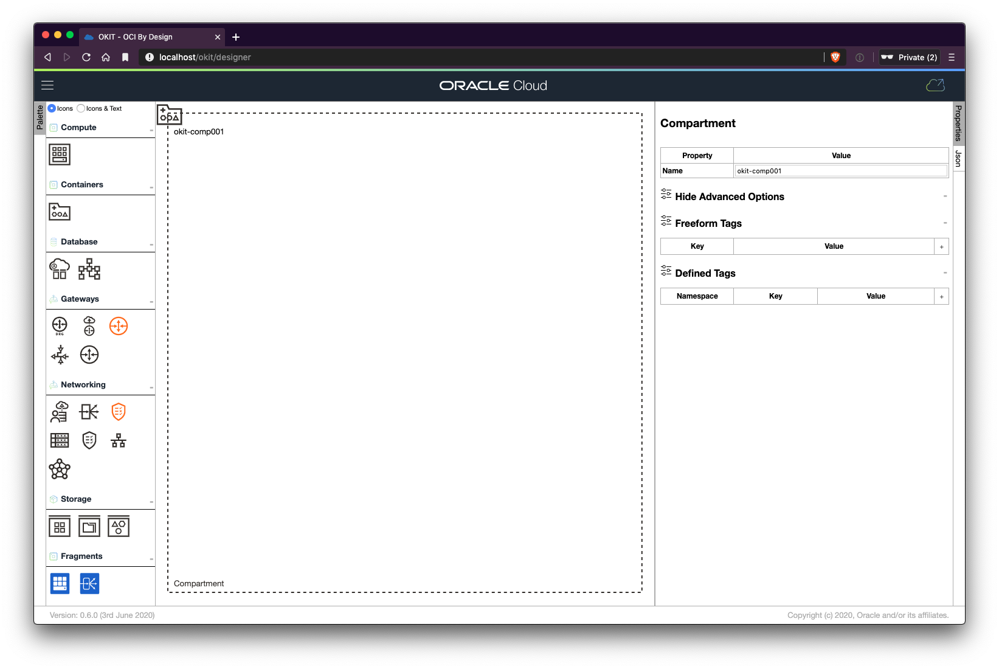
## Step 2 : Add Virtual Cloud Network
The first this we will need for our Load Balancer example is to create a Virtual Cloud Network and this can be achieved 
by dragging the Virtual Cloud Network Icon  
from the palette onto the compartment. Doing this will create a Simple Virtual Cloud Network and populate it with a default
Route Table and Security List. Again if the names do not match you requirements select the Artifact and edit in the properties panel.
Looking at the Properties you will notice that a number of default values have been assigned including the CIDR which will
be 10.0.0.0/16, If a second Virtual Cloud Network is added its CIDR will be 10.1.0.0/16 thus keeping them unique.

These can be removed by Right-Clicking on them and selecting Delete but we will not do this because they are appropriate
in this example. The generation of these is optional and configured in the settings window (see radio buttons at top of properties panel).

## Step 3 : Add Internet Gateway
To allow access to our system we will need an Internet Gateway added to the Virtual Cloud Network. We will do this in the 
same way we did for the Virtual Cloud Network but selecting the Internet Gateway Icon 
from the palette and dragging it over the Virtual Cloud Network. You should note whilst doing this how the drag Icon changes
to indicate allowable drop targets.
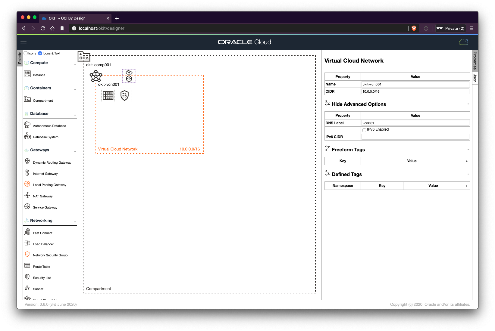
## Step 4 : Select Route Table
The auto generated Route Table will need to be modified to add a Route Rule to direct traffic to the Internet Gateway. Select
the Route Table  on the Canvas and its
properties will appear in the properties Panel. Click the Green ***"+"*** button on the rules table and a new Rule will be created.
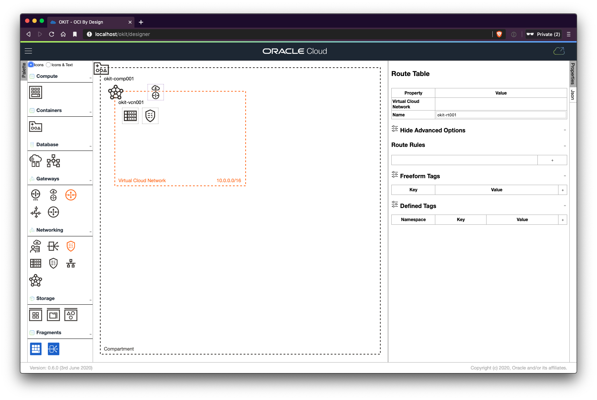
Within the new Rule we will specify the Destination (CIDR Block) and the appropriate Gateway (Network Entity).
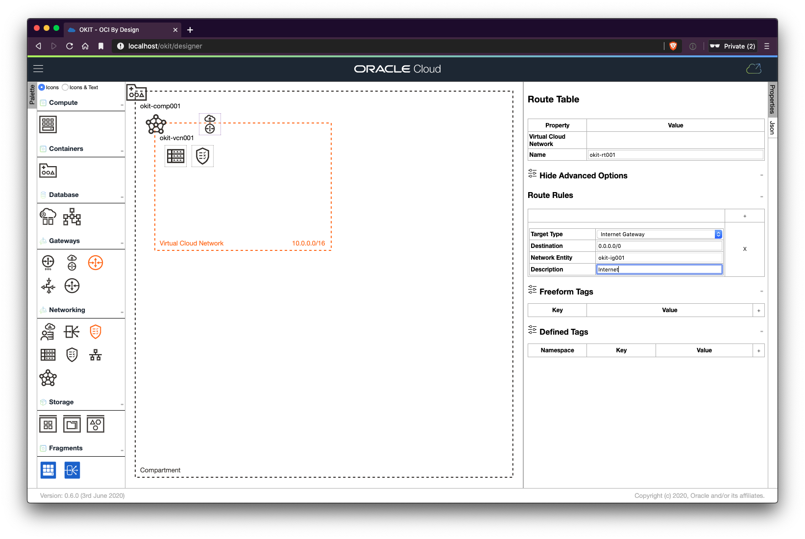
## Step 5 : Add Subnet
We will now add a Subnet to our diagram by selecting the Subnet Icon 
from the Palette and dragging it over the Virtual Cloud Network. Dropping this will create place a Subnet on our Virtual Cloud Network
with a CIDR based on its parent (10.0.0.0/24) Additional Subnet will increment the 3rd Octet. 
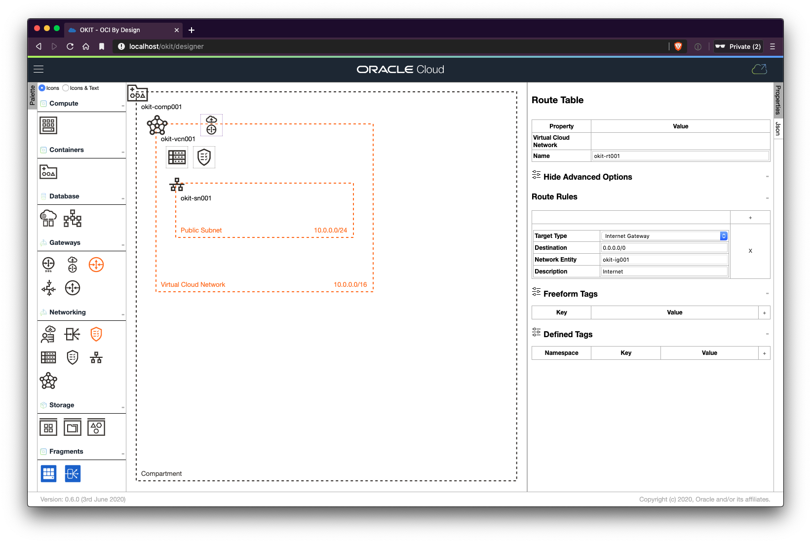
## Step 6 : Connect Subnet to Route Table & Security List
To allow Artifacts within the network to access / be accessed by the internet we will need to provide it with a Route Table 
and Security List. We can achieve this by selecting the Subnet and editing the properties to select the existing Route Table abd Security List.
Once this has been done you will notice that the Route Table Icon 
and Security List Icon  have moved to the 
top edge of the Subnet to indicate that the Subnet has assigned Route Table and Security. Additional Subnet can also select the same 
Route Table and Security List.
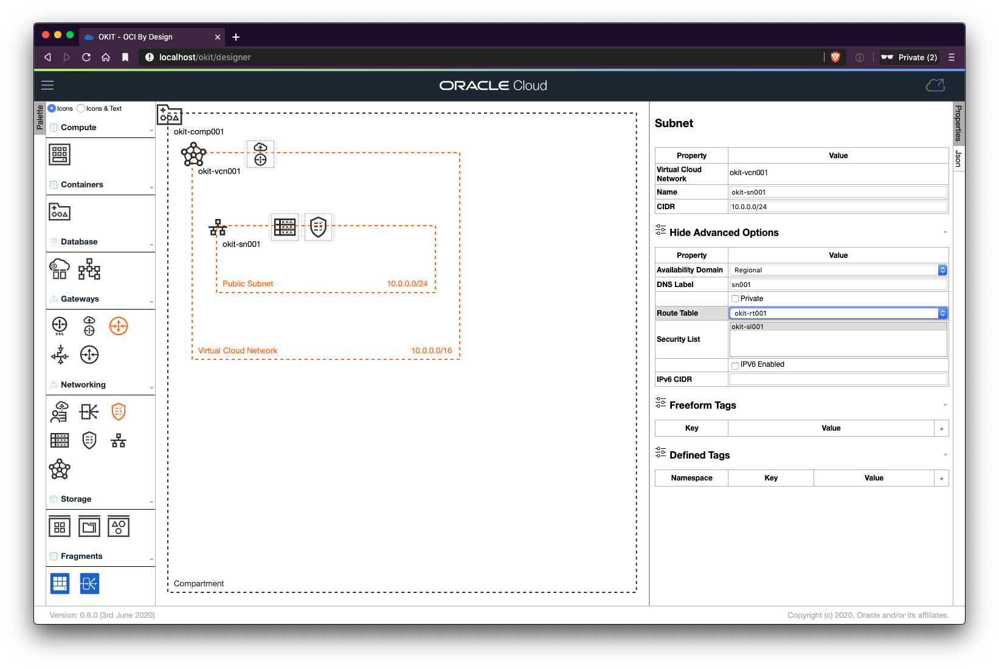
## Step 7 : Add Instances
We will now create 2 Instances within the Subnet by dragging the Instance Icon 
from the Palette and dropping it on the Subnet. You will notice that the second Instance will have the designation "002" 
rather than "001".
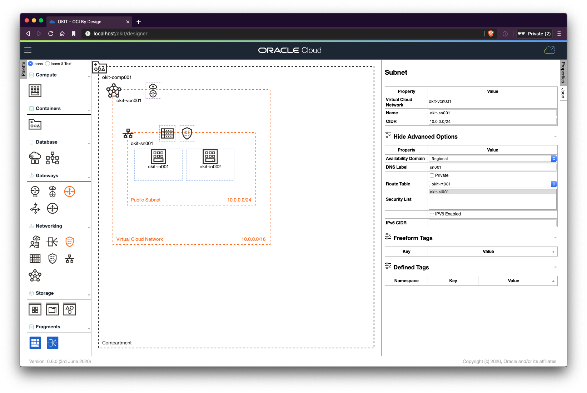
## Step 8 : Add load Balancer
Next well will create a Load Balancer by dragging the Load Balancer Icon 
from the Palette onto the Subnet. You will notice that Instances move and this is because the Visualiser controls placement 
and will dynamically move / resize components to best display the system.
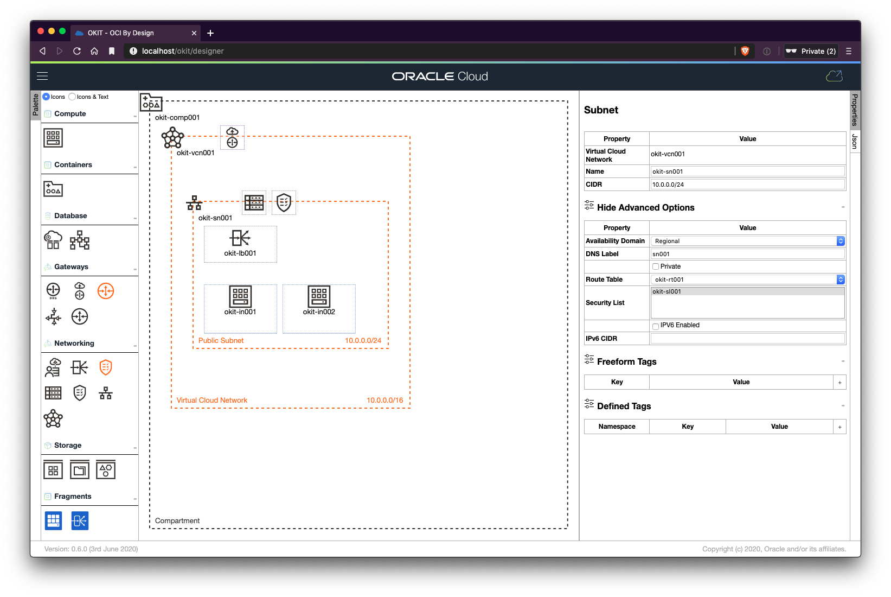
## Step 9 : Connect Load Balancer to Instances
Now we will need to connect the Load Balancer to the 2 backend Instance and we will do this by selecting the Load Balancer 
and in the displayed Properties panel selecting the 2 Instances displayed in the "Backend Instance" Select box. On doing this
you note that Load Balancer and the Instances become connected in the diagram.
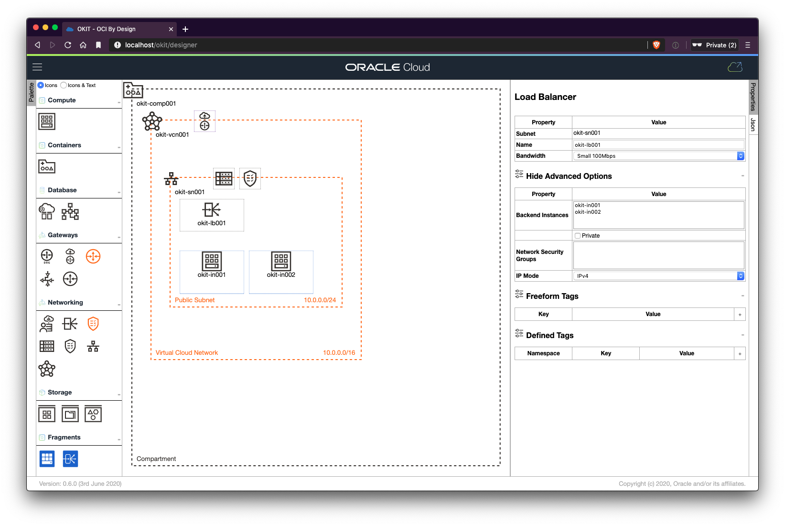
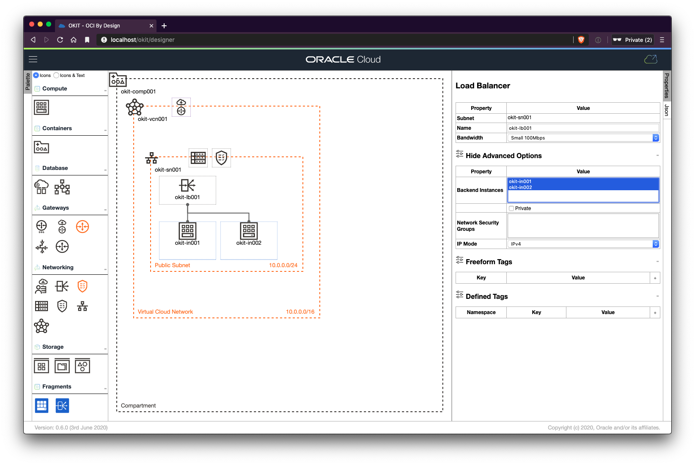
## Step 10 : Update Instance Properties
Our final step will be to update each of the instances to provide an Authorised Key for the instance and a Cloud Init YAML
to install and configure nginx. We will do this by selecting each Instance individually and editing the properties and using 
the [Cloud Init YAML](#cloud-init-yaml) below. Once this has been done our diagram is now complete and can be saved using the 
"Save" option below the "Hamburger" menu. 
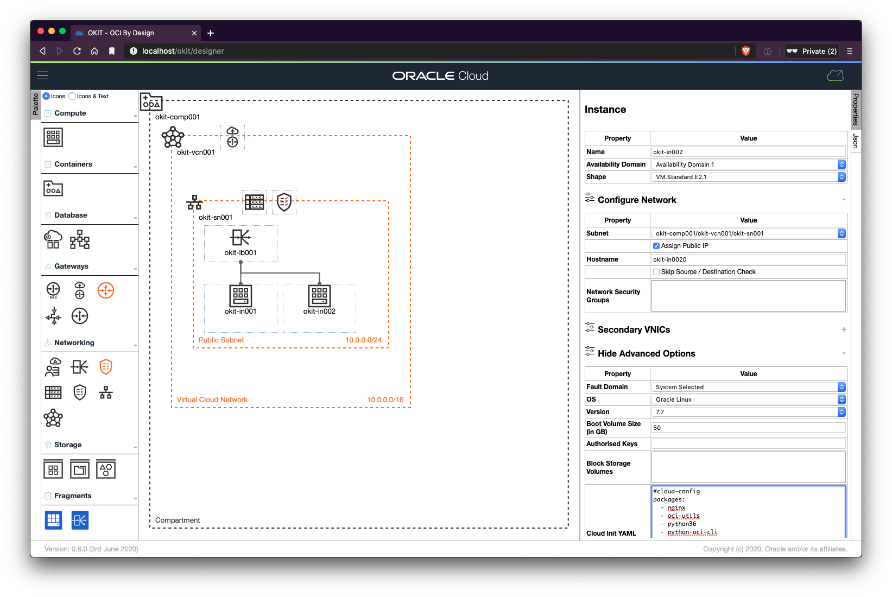
### Cloud Init YAML
```yaml
#cloud-config
packages:
  - nginx
  - oci-utils
  - python36
  - python-oci-cli

write_files:
  # Add aliases to bash (Note: At time of writing the append flag does not appear to be working)
  - path: /etc/.bashrc
    append: true
    content: |
      alias lh='ls -lash'
      alias lt='ls -last'
      alias env='/usr/bin/env | sort'
      alias whatsmyip='curl -X GET https://www.whatismyip.net | grep ipaddress'
  # Create nginx index.html
  - path: /usr/share/nginx/html/index1.html
    permissions: '0644'
    content: |
      <html>
      <head>
      <title>OCI Loadbalancer backend {hostname}</title>
      <meta http-equiv="Content-Type" content="text/html; charset=UTF-8" />
      <meta http-equiv="refresh" content="10" />
      <style>
      body {
      background-image: url("bg.jpg");
      background-repeat: no-repeat;
      background-size: contain;
      background-position: center;
      }
      h1 {
      text-align: center;
      width: 100%;
      }
      </style>
      </head>
      <body>
      <h1>OCI Regional Subnet Loadbalancer Backend {hostname}</h1>
      </body>
      </html>

runcmd:
  # Enable nginx
  - sudo systemctl enable nginx.service
  - sudo cp -v /usr/share/nginx/html/index1.html /usr/share/nginx/html/index.html
  - sudo sed -i "s/{hostname}/$(hostname)/g" /usr/share/nginx/html/index.html
  - sudo systemctl start nginx.service
  # Set Firewall Rules
  - sudo firewall-offline-cmd  --add-port=80/tcp
  - sudo systemctl restart firewalld
  # Add additional environment information because append does not appear to work in write_file
  - sudo bash -c "echo 'source /etc/.bashrc' >> /etc/bashrc"

final_message: "**** The system is finally up, after $UPTIME seconds ****"
```

## Terraform Generation & Execution
For the diagram you are able to select the menu option Generate->Terraform and this will generate a oci_terraform.zip 
that can be saved and extracted to produce 3 files that can be used by terraform. If we assume that the export have been
generated from the 'Load Balanced Nginx Instances' Template then the infrastructure can be created as follows.

### Unzip Generated File
```bash
lh
total 20K
   0 drwxr-xr-x 4 root root  128 Oct 31 16:20 .
4.0K drwxr-xr-x 1 root root 4.0K Oct 28 18:00 ..
8.0K -rw-r--r-- 1 root root 6.1K Oct 31 16:20 .DS_Store
8.0K -rw-r--r-- 1 root root 5.4K Oct 31 16:20 okit-terraform.zip

unzip okit-terraform.zip -d okit-terraform
Archive:  okit-terraform.zip
  inflating: okit-terraform/variables.tf
  inflating: okit-terraform/main.tf
  inflating: okit-terraform/terraform.tfvars
```

### Plan Terraform Build
```bash
cd okit-terraform
terraform init

..........

terraform plan -var-file=/okit/config/connection.tfvars -out=da.plan
Refreshing Terraform state in-memory prior to plan...
The refreshed state will be used to calculate this plan, but will not be
persisted to local or remote state storage.
..........
```

### Apply Terraform Plan
```bash
terraform apply da.plan
oci_core_vcn.Okit-Vcn001: Creating...
oci_core_volume.Okit-Bsv001: Creating...
..........
```

### Unzip Generated File
```bash
unzip okit-ansible.zip -d okit-ansible
Archive:  okit-ansible.zip
```

### Run Playbook
```bash
ansible-playbook main.yml --extra-vars "@/okit/config/connection.yml" 
```


